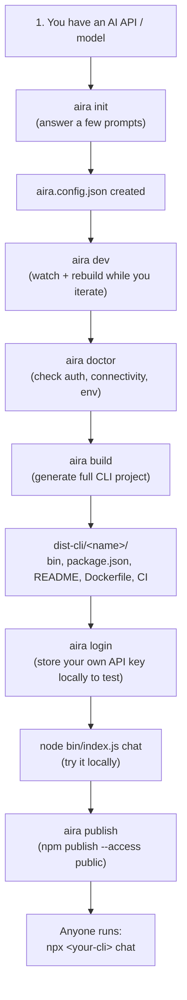

<div align="center">


# Aira CLI Kit

**Turn any AI API into a professional, cross-platform CLI application — by configuring one file.**

[](./LICENSE)
[](https://nodejs.org)
[](./CONTRIBUTING.md)

`ai` · `cli` · `nodejs` · `typescript` · `commander` · `developer-tools` · `automation` · `llm` · `openai` · `anthropic` · `npm`

Built and maintained by **Aira Group Of Technology**

⭐ If Aira CLI Kit saves you time, consider starring the repo — it helps other AI developers find it.

</div>

---

## Why Aira CLI Kit

If you already have an AI API or model, shipping it as a real CLI usually means writing the same boilerplate every time: argument parsing, an interactive chat loop, login/config handling, an update command, cross-platform packaging, npm/npx publishing, and a help screen that doesn't look like an afterthought.

Aira CLI Kit removes that boilerplate. You describe your API in one `aira.config.json` file, and Aira generates a complete, publishable CLI project around it.

```json
{
  "name": "openhands",
  "displayName": "OpenHands",
  "provider": "custom",
  "api": "https://example.com/chat",
  "auth": { "type": "bearer", "envVar": "OPENHANDS_API_KEY" },
  "commands": [
    { "name": "chat", "description": "Chat with OpenHands", "interactive": true }
  ]
}
```

```bash
aira build
```

That's it — you now have a `openhands` CLI with a `chat` command, a themed banner, encrypted credential storage, a `doctor` diagnostics command, a README, a Dockerfile, and a GitHub Actions release workflow, ready to `npm publish`.

## Full workflow

This is the complete path from "I have an AI API" to "I have a published CLI that anyone can `npx`."



### Step by step

1. **Describe your API.** Run `aira init` and answer a handful of prompts (binary name, base API URL, auth type, provider). This writes `aira.config.json` — the only file you maintain by hand.
2. **Iterate locally.** Run `aira dev`. It builds the CLI once, then watches `aira.config.json` and rebuilds automatically every time you save — so you can add a new command or tweak a `requestTemplate` and immediately re-test.
3. **Sanity-check the setup.** Run `aira doctor` to confirm Node version, config validity, that your auth env var is set, and that your API endpoint actually responds.
4. **Generate the real project.** Run `aira build`. This writes a complete, standalone CLI project to `dist-cli/<name>/` — Commander entry point, baked-in runtime config, `package.json`, `README.md`, `Dockerfile`, and a GitHub Actions release workflow.
5. **Store credentials safely.** Run `aira login` to save your API key with AES-256-GCM encryption on disk (or just export the env var named in your config — both work).
6. **Test the generated CLI directly**, exactly as your end users will run it:
   ```bash
   cd dist-cli/<name>
   npm install
   node bin/index.js chat
   ```
7. **Publish it.** Run `aira publish` (or `cd dist-cli/<name> && npm publish`). From then on, anyone can run `npx <your-cli>` or `npm install -g <your-cli>` — no knowledge of Aira required on their end, since the generated CLI only depends on `@aira/runtime` and `commander`.
8. **Ship updates.** Change `aira.config.json`, run `aira build` again, bump the version, publish. The generated project's GitHub Actions workflow (`release.yml`) also handles this on every `git tag v*` push if you push the generated project to its own repo.

## Quick start

```bash
npm install -g aira-cli-kit

aira init      # interactively create aira.config.json
aira dev       # build + watch while you iterate
aira build     # generate the full CLI project
aira publish   # build and publish to npm
```

## Framework commands

| Command | Description |
|---|---|
| `aira init` | Scaffold a new `aira.config.json` interactively |
| `aira dev` | Rebuild automatically as you edit the config |
| `aira build` | Generate the complete CLI project |
| `aira config` | Show or validate the current config |
| `aira doctor` | Check environment, auth, and API connectivity |
| `aira plugin list` | List official plugins |
| `aira publish` | Build and publish the generated CLI to npm |
| `aira login` / `logout` | Store or clear an API key securely on this machine |
| `aira update` | Update Aira CLI Kit itself |

## What gets generated

```
dist-cli/openhands/
├── bin/index.js            # Commander-based CLI entry
├── bin/aira.runtime.json   # config baked in — no Aira dependency at runtime
├── package.json
├── README.md
├── Dockerfile
└── .github/workflows/release.yml
```

The generated CLI depends only on `@aira/runtime` (a small shared package for API calls, auth, chat REPL, and themed output) plus `commander` — not on Aira itself. That keeps `npm install -g` fast for your users.

## Config reference

| Field | Description |
|---|---|
| `name` | Binary name, e.g. `openhands` |
| `provider` | `openai` \| `anthropic` \| `custom` \| `ollama` \| `huggingface` |
| `api` | Base URL of your AI API |
| `auth` | `{ type: "bearer" \| "api-key" \| "basic" \| "none", envVar, header }` |
| `commands` | Array of command definitions (endpoint, request template, response path, interactivity) |
| `plugins` | Array of plugin references, e.g. `{ "name": "vision" }` |
| `theme` | Colors, gradient, logo style for the generated banner |

See [`templates/aira.config.example.json`](./templates/aira.config.example.json) and the full [OpenHands example](./examples/openhands/aira.config.json).

## Agent abilities (file read/write/edit)

A `chat` command can be given permission to read, list, write, or edit files in the user's project — enough to build a Claude-Code-style coding assistant on top of your own API.

```json
{
  "name": "chat",
  "interactive": true,
  "tools": ["read_file", "write_file", "edit_file", "list_files"]
}
```

Your API signals a file action by including a fenced JSON block in its Markdown response:

````
```agent-action
{
  "type": "write_file",
  "path": "hello.py",
  "content": "print('hi')"
}
```
````

### Supported Tools & Payload Formats

Aira CLI Kit runtime supports the following tools when listed under `tools`:

1. **`list_files`**  
   Lists all entries inside a directory.  
   * **Request payload**: `{ "type": "list_files", "path": "dir_name" }`  
   * **Result**: Echoes 📂 list action and returns a list of file/directory names.

2. **`read_file`**  
   Reads the entire text content of a file.  
   * **Request payload**: `{ "type": "read_file", "path": "path/to/file.txt" }`  
   * **Result**: Echoes 📖 read action and returns the raw file content.

3. **`write_file`**  
   Creates a new file or overwrites an existing file.  
   * **Request payload**: `{ "type": "write_file", "path": "path/to/file.txt", "content": "file content here" }`  
   * **Result**: Displays an 800-character preview, asks for user confirmation (**y/n**), and writes to disk on approval.

4. **`edit_file`**  
   Replaces a specific block of text inside a file (search and replace).  
   * **Request payload**: `{ "type": "edit_file", "path": "path/to/file.txt", "find": "old code block", "replace": "new code block" }`  
   * **Result**: Shows a diff-style preview (`-` old / `+` new up to 200 characters), asks for user confirmation (**y/n**), and edits on approval.

### Safety Rules (Enforced by Aira)

* **Path containment**: Every path is strictly resolved against the current directory (`process.cwd()`). Attempts to reference paths outside this directory (using `..` or absolute paths) will fail with an error.
* **Explicit confirmation**: Any write or edit operation always requires a typed confirmation (`y/n`) from the user. There is no auto-approve mode.
* **User transparency**: Read and list operations do not block for confirmation, but they are clearly logged to the terminal so the user knows exactly what the agent accessed.

See [`examples/coding-agent/aira.config.json`](./examples/coding-agent/aira.config.json) for a full working example.

## Chat History

For interactive commands (`"interactive": true`), you can enable session-based chat history to remember context across turns.

To use chat history:
1. Set `"history": true` on the command.
2. In your `"requestTemplate"`, use the `"{{history}}"` or `"{{messages}}"` placeholder where the history array should be injected.

```json
{
  "name": "chat",
  "interactive": true,
  "history": true,
  "requestTemplate": {
    "model": "gpt-4o",
    "messages": "{{messages}}"
  }
}
```

The history array format sent to your API will be:
```json
[
  { "role": "user", "content": "Hello!" },
  { "role": "assistant", "content": "Hi there! How can I help you today?" }
]
```

At any point during the interactive session, the user can type `clear` or `/clear` to clear the current chat history.

## Plugins

Plugins are ordinary npm packages named `aira-plugin-*` that hook into build time (`onBuild`) or CLI runtime (`onCommand`). Official plugins in progress:

`image` · `vision` · `ocr` · `voice` · `translate` · `rag` · `pdf` · `email` · `db` · `websearch`

```bash
npm install aira-plugin-vision
```
```json
{ "plugins": [{ "name": "vision" }] }
```

## Architecture

Aira is a monorepo:

- `src/` — the `aira` framework CLI (commands, config loader, builder, templates)
- `packages/runtime/` — `@aira/runtime`, the shared package generated CLIs depend on

See [`docs/ARCHITECTURE.md`](./docs/ARCHITECTURE.md) for how config becomes a CLI, and how to extend the builder, themes, and plugin system.

## Security

- API keys are encrypted at rest (AES-256-GCM) via `aira login`, never stored in plain text
- Or use environment variables directly — your choice
- **No telemetry.** Aira collects nothing, by design

## Roadmap

- [ ] Plugin marketplace
- [ ] GUI config builder
- [ ] VS Code extension
- [ ] Cloud sync for config/credentials
- [ ] Auto-generated docs site per CLI
- [ ] AI-assisted command generator (`aira ai-generate`)

## Contributing

Contributions are very welcome — new plugins, generated-file templates, themes, and bug reports all help. See [`CONTRIBUTING.md`](./CONTRIBUTING.md).

## GitHub Topics

For discoverability, set these under **repo → Settings → Topics**:
`ai` `cli` `nodejs` `typescript` `commander` `developer-tools` `automation` `llm` `openai` `anthropic` `npm`

## License

MIT © [Aira Group Of Technology](mailto:support@airaai.work.gd)

---

<div align="center">
<sub>Maintained by Aira Group Of Technology · support@airaai.work.gd</sub>
</div>
